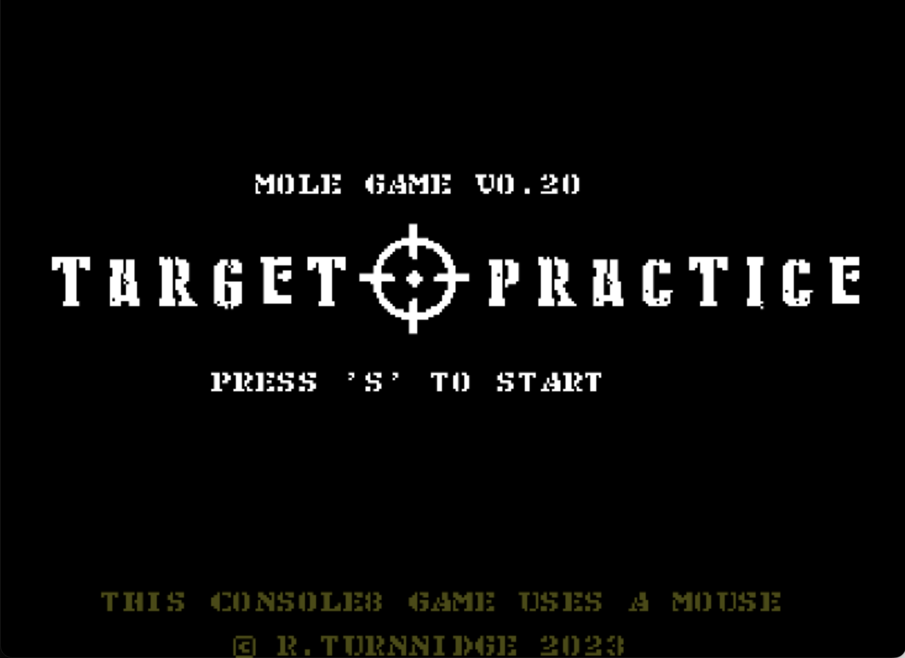
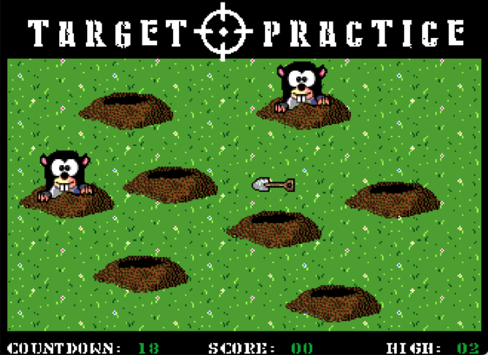

# Target Practice
Mouse handline practice game.
This game is for Agon Console8 with a mouse, or Agon Light 2 with a mouse adapter attached.

Those pesky moles have been digging up your nice lawn.
It uses the mouse to control your spade.
You have 30 seconds to whack as many as you can with your spade.

I started this game as a way to show the use of a mouse on the Console8, but it just evolved from there.

I will probably add better sound effects at some point.

Download the binary and copy to the root level of your SD card (or a folder of your choice). 

Load the binary, then run it.

For recent versiosn of MOS, simply type the name of the binary (without the .bin) and hit enter.

If you download and enjoy this game, or find the code useful, you could buy me a coffee if you wish:
https://www.buymeacoffee.com/richardturnnidge
